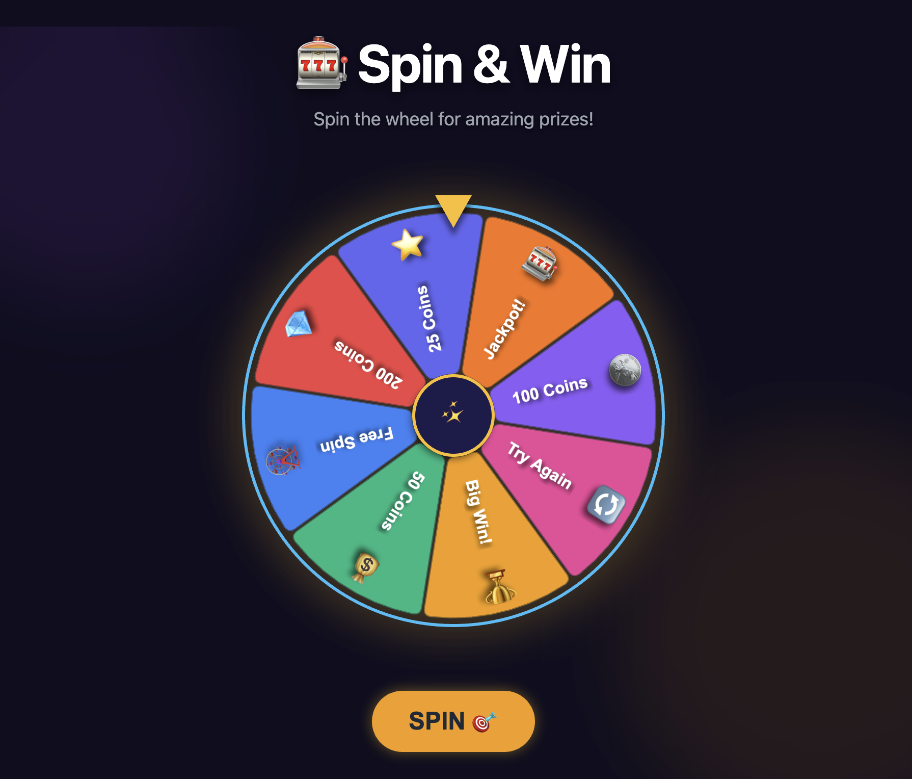

# 🎡 spinning_wheel_app

A classic **dynamically drawn spinning wheel** POC built with **HTML5**, **TypeScript**, and the **PixiJS** game rendering library.  
The wheel is rendered programmatically, animated with smooth easing, and paired with accessible HTML UI overlays.



This project is designed to demonstrate **canvas-based rendering**, **game-style animation**, and **clean separation between rendering and UI logic**.

---

## ✨ Features

- 🎨 Dynamically drawn spinning wheel (no pre-rendered assets)
- ⚡ High-performance rendering via **PixiJS**
- 🧠 Deterministic spin logic with easing and deceleration
- 🎯 Prize detection based on final rotation angle
- 🧩 TypeScript-first architecture
- ♿ UI overlays in HTML/CSS for accessibility
- 📱 Responsive layout (desktop & mobile friendly)

---

## 🛠 Tech Stack

- **HTML5 Canvas**
- **TypeScript**
- **PixiJS**
- **CSS3** (UI overlays & modal)
- **ES Modules**

---

## 📂 Project Structure

```

spinning_wheel_app/
├── index.html        # HTML shell + UI overlays
├── main.ts           # PixiJS app + wheel logic
├── style.css         # UI styling
└── README.md

````

---

## 🚀 Getting Started

### Prerequisites
- Node.js (18+ recommended)
- A modern browser (Chrome, Firefox, Edge)

### Install & Run

```bash
npm install
npm run dev
````

Or serve directly if using a simple dev server:

```bash
npx serve .
```

Then open:

```
http://localhost:3000
```

---

## 🎮 How It Works

### Rendering

* The wheel is drawn dynamically using **PixiJS Graphics**
* Each slice is rendered with:

  * Arc geometry
  * Color fill
  * Label positioning
* The entire wheel rotates around its center point

### Spin Logic

1. User triggers a spin
2. A target rotation angle is calculated
3. Easing is applied for acceleration/deceleration
4. Final angle determines the winning slice
5. Prize modal is displayed via HTML overlay

### UI Separation

* **PixiJS** handles rendering and animation
* **HTML/CSS** handles:

  * Title
  * Prize modal
  * Buttons
* This keeps the canvas clean and accessible

---

## 🧠 Key Concepts Demonstrated

* Canvas coordinate transforms (`translate`, `rotate`)
* Game-loop style animation
* Angle normalization and modular arithmetic
* Separation of concerns (rendering vs UI)
* Deterministic outcome handling (useful for games of chance)

---

## 🔧 Customization

You can easily:

* Change prize labels and colors
* Adjust spin duration and easing
* Add sound effects
* Hook the result into:

  * Backend APIs
  * Analytics
  * Reward systems

---

## 📈 Potential Extensions

* 🎵 Sound effects
* 🪙 Weighted probabilities
* 🌐 Server-side spin validation
* 🤖 AI-generated prize logic
* 📊 Spin analytics dashboard

---

## 📜 License

MIT License — free to use, modify, and extend.

---

## 👤 Author

Built as a demonstration of **HTML5 canvas game mechanics** using modern TypeScript and PixiJS patterns.
No React dependencies.
